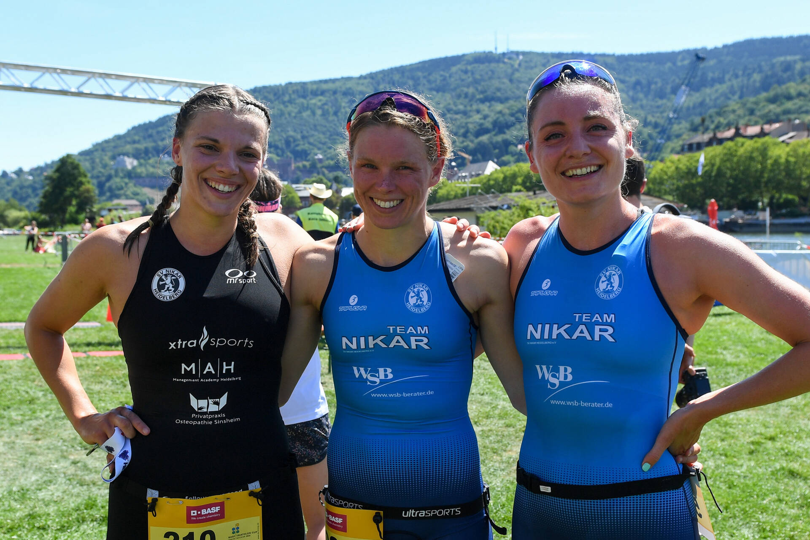

## Plappert und Jansen feiern Heimsiege

Beim HeidelbergMan gewinnen zwei Lokalmatadore - Die Frauen des SV Nikar Heidelberg sind nicht zu schlagen

Heidelberg. Gute Freunde kann niemand trennen. Schon gar nicht ein Wettkampf. Diese alte Weisheit, die Franz Beckenbauer schon 1966 in einem Hit besang, sie gilt noch immer. Unter der Woche sind Kathrin Halter, Laura Jansen und Ursula Trützschler vom [SV Nikar Heidelberg](https://sv-nikar.de) nämlich nicht nur in der selben Trainingsgruppe – die Triathlon-Damen verstehen sich auch privat bestens.

[... weiter lesen in der RNZ](https://www.rnz.de/sport/sportregional_artikel,-plappert-und-jansen-feiern-heimsiege-_arid,926869.html)