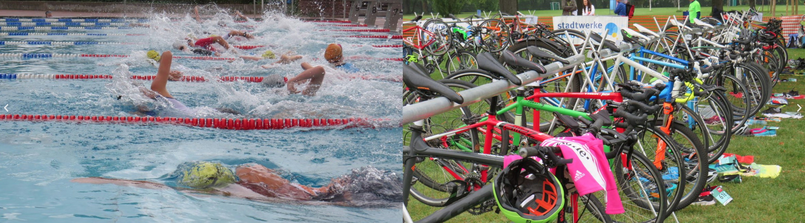
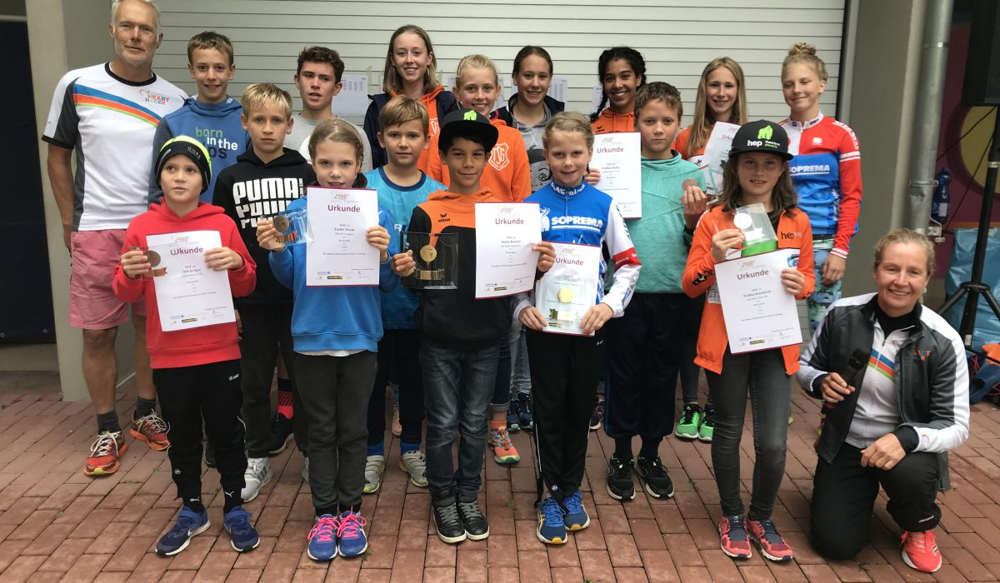

## Mehr als 150 Teilnehmer*innen beim Heart Racer Junior Triathlon 2022

Am 11.September fand der Heart Racer Junior Triathlon im Freizeibad Tiergartenstrasse in Heidelberg statt. Mit 152 Finishern waren wir in diesem Jahr die größte Veranstaltung des Rhein Neckar Triathlon Cup für die Junioren.

Die neuen Organisatoren vom Heart Racer Team und SV Nikar Heidelberg durften die 7 – 18 jährigen Starter bei bestem Wetter auf die Strecke schicken. Es waren 5 Altersklassen und Staffeln auf unterschiedlichen Strecken unterwegs.

Die Kleinsten starteten über 50m Schwimmen, 2km Radfahren und 400m Laufen, die Ältesten mussten mit 200m Schwimmen, 12km Radfahren und 2,8km Laufen schon deutlich mehr Strecke zurücklegen.

Mit großer Unterstützung der Eltern und freiwilligen Helfer an der Strecke hatten wir viele glückliche Kinder und Jugendliche, die zu Recht stolz auf ihre Leistungen sein durften.

Besonders gefreut haben wir uns über die beiden Heart Racer Jugendlichen, die zusammen mit ihren Guides ihren ersten Triathlon gefinished haben. Wir hatten im Sommer in einem Camp trainiert und Leon und Linus haben sich der Herausforderung Triathlon gestellt. Begleitet von Robert und Markus haben sie es geschafft und durften wie alle anderen im Ziel ihr Finisher Geschenk und viele Glückwünsche entgegennehmen.

Wir hoffen im nächsten Jahr wieder auf eine gelungene Veranstaltung und würden uns freuen noch etwas mehr Unterstützung bei der Organisation zu haben. Wenn Eltern oder andere freiwillige Lust und Zeit haben uns zu unterstützen, meldet Euch info@heart-racer.org.

Ganz herzliches Dankeschön an alle Helfer und ein besonderes Dankeschön an die Stadtwerke Heidelberg und die Stadt Heidelberg, die uns seit Jahren unterstützen und die Veranstaltung möglich machen.

[Zur Heart Racer Seite](https://www.heart-racer.org/mehr-als-150-teilnehmerinnen-beim-heart-racer-junior-triathlon-2022/)

