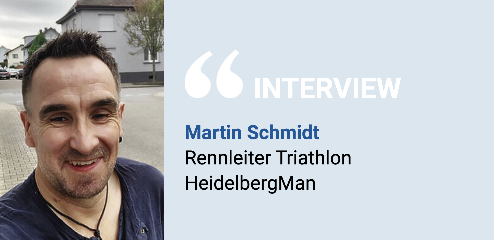

## Der HeidelbergMan ist zwar beliebt, jedoch sinken die Starterzahlen

Mit dem Fahrrad geht es auf knapp 36 Kilometern gleich zweimal den Königsstuhl hoch, bevor das Rennen mit einem Zehn-Kilometer-Lauf über den Philosophenweg endet.

Heidelberg. Der Heidelberger Triathlon – der HeidelbergMan – ist spektakulär: Die Teilnehmer schwimmen zuerst – in einzigartiger Kulisse an der Altstadt vorbei – 1,6 Kilometer durch den Neckar. Mit dem Fahrrad geht es dann auf knapp 36 Kilometern gleich zweimal den Königsstuhl hoch, bevor das Rennen mit einem Zehn-Kilometer-Lauf über den Philosophenweg endet.

Wegen der vielen zu bewältigenden Höhenmetern hat es diese Olympische Distanz in sich. Warum das eine gute Vorbereitung auf den Iron Man ist und wieso seit Corona die Teilnehmerzahl beim HeidelbergMan rückläufig ist, erklärt Rennleiter Martin Schmidt.

[... weiter lesen in der RNZ](https://www.rnz.de/region/heidelberg_artikel,-triathlon-der-heidelbergman-ist-zwar-beliebt-jedoch-sinken-die-starterzahlen-_arid,1032402.html)