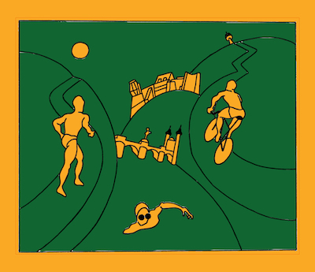

Liebe Triathleten und Fans des HeidelbergMan,

mit großem Bedauern müssen wir euch mitteilen, dass der HeidelbergMan Triathlon 2023 nicht stattfinden wird. In den letzten Monaten haben wir uns mit verschiedenen Schwierigkeiten auseinandersetzen müssen, die es uns unmöglich machen, die Veranstaltung wie geplant durchzuführen. Wie viele andere Veranstalter haben auch wir seit Beginn der Corona-Pandemie mit stark rückläufigen Teilnehmerzahlen zu kämpfen - sowohl bei den Teilnehmer wie aber auch beiden erforderlichen ehrenamtlichen Helfern und in der Besetzung des Orga-Teams. Diese bedauerliche Entwicklung hat uns bereits an den letzten Jahren an die Grenzen unserer Ressourcen und Belastbarkeit gebracht.

Um den HeidelbergMan in seiner traditionellen Form und mit der von uns gewünschten Qualität durchführen zu können bedarf es einer Mindestbesetzung in unserem Orga-Team. Aktuell fehlen uns hier leider an zu vielen entscheidenden Positionen die personelle Besetzung.  Wir haben uns entschlossen, die Gesundheit und Sicherheit unserer Teilnehmer, Helfer und Zuschauer an erste Stelle zu setzen und unter diesen Umständen das Event abzusagen.

Es ist eine sehr schwierige Entscheidung für uns, insbesondere da wir uns auf eine ganz besondere Veranstaltung gefreut haben. 2023 wäre der 30. HeidelbergMan Triathlon gewesen, und wir hatten uns darauf vorbereitet, das Jubiläum gebührend zu feiern. Aber unter den aktuellen Umständen sehen wir uns leider gezwungen, die Veranstaltung abzusagen.

Wir möchten uns bei allen Triathleten und Fans bedanken, die uns in den vergangenen Jahren unterstützt haben. Ihr habt uns zu einem erfolgreichen Event gemacht, und eure Begeisterung für den Triathlonsport war für uns immer eine Inspiration. Wir wissen, dass diese Entscheidung für euch enttäuschend sein wird, und wir bitten um euer Verständnis für unsere Situation.

Wir möchten auch allen ehrenamtlichen Helfern danken, die uns in der Vergangenheit unterstützt haben. Ohne eure wertvolle Hilfe wäre es uns nicht möglich gewesen, eine so großartige Veranstaltung auf die Beine zu stellen. Wir hoffen, dass ihr uns in Zukunft wieder unterstützen werdet, wenn wir uns entscheiden, den HeidelbergMan Triathlon erneut zu veranstalten.

Wir möchten euch ermutigen, weiterhin aktiv zu bleiben und eure Leidenschaft für den Triathlonsport aufrechtzuerhalten. Auch wenn wir 2023 nicht zusammenkommen können, hoffen wir, dass wir uns in Zukunft wiedersehen werden, wenn wir neue Veranstaltungen planen.

Nochmals vielen Dank für eure Unterstützung und euer Verständnis.

Das HeidelbergMan Orga Team

